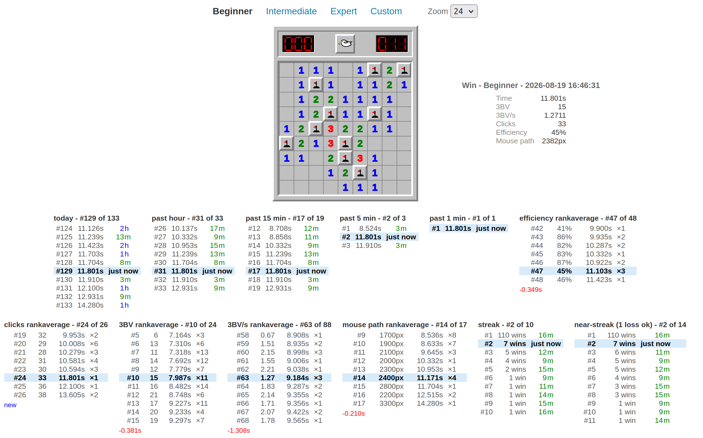

# minesweeper-friendly

**Play now: https://ernop.github.io/minesweeper-friendly/**

Minesweeper variant project. Current contents: a clone of minesweeper.online's
standard mode. Planned: friendlier variants along the solver-aware design axis
(see `agents.md`).



## Run

No dependencies, no build step. Open `index.html` in a browser, or:

```bash
python3 -m http.server 8018
```

then http://localhost:8018/

## Controls

- Left click: reveal a cell (first click is never a mine)
- Right click: place/remove a flag
- Left click on a satisfied number: chord (open all unflagged neighbors)
- Face button or space bar: new game
- Tabs: Beginner 9x9/10 (default), Intermediate 16x16/40, Expert 30x16/99, Custom

## Play history

Every finished game, win or loss, is kept in localStorage per mode. Each
record stores only the primary measurements — end date, outcome, time, 3BV,
clicks, and mouse path (total cursor distance in px from first click to game
end); derived stats (3BV/s, efficiency, mouse speed, and the rest) are
computed at display time. After each win the result panel shows the full
stats plus one ranked-list column per time window. Day-and-longer windows anchor to your
local calendar: "today" since last midnight, "past week" since midnight six
days back, "this month" and "in <year>" since their calendar starts, and
"in the last year" since the end of the day exactly 365 days prior; hour /
15 min / 5 min / 1 min windows roll continuously. Then day-category columns:
all scores set on
today's weekday ("on Wednesdays"), on weekends or weekdays (whichever today
is), and on US federal holidays when today is one. Columns reveal
themselves gradually: a chart only appears once it would actually differ —
if every game you've played was today, "this month" and "lifetime" would
just repeat "today", so they stay hidden until your history spreads out
enough to make them distinct.
Rankaverage charts group your wins by efficiency, clicks, 3BV, 3BV/s
(2 decimals), mouse path (nearest 100px), and mouse speed (nearest 10px/s),
ranked by each group's average solve time; every row shows the rank, the value, the group's average time,
and how many wins share it, with your group bolded. A colored final row,
aligned under the average-time column, shows how this win moved its own
group's average time: improved/worsened by how much, unchanged, or set for
the first time.
The stats themselves (time, 3BV, 3BV/s, clicks, efficiency, mouse path,
mouse speed, path per click, path per 3BV)
render as a small label/value table beside the board, including wasted
clicks (board clicks that changed nothing — recorded per game since
2026-08-19; older records lack the measurement) and, for wins, clicks over
3BV (clicks beyond the board's minimum). At the bottom, ten small
scatter plots chart every win: win time vs date, win time vs hour of day,
3BV vs time, clicks vs 3BV (with the clicks = 3BV floor drawn in), wasted
clicks vs 3BV/s, mouse path vs time, mouse speed vs time, mouse speed vs
efficiency, path per click vs efficiency, and path per 3BV vs time — so
you can see whether moving faster actually wins games faster, and whether
you're improving at all. Each axis carries a spelled-out label with
units; dots are colored by how long ago each win was (same palette as the
rank-list ages, with a legend below), and your newest game is the
black-ringed dot tagged with its rank among today's wins. Streak lists rank
your win runs: "streak" (consecutive wins), "near-streak" (runs spanning at
most 1 loss), and "near-near-streak" (at most 2), each row showing length
and how long ago the streak's last win was; recorded losses split the
streaks. Each list windows around your row, 11 rows max: when you rank in
the top 11 the list simply shows the top 11 with your row in place;
otherwise it centers on you with the 5 nearest entries either side. Rows
show rank, time, and a relative age ("43s", "5m", "2w"; the brand-new score
says "just now").

Backup: subtle "export history" / "import history" controls under the
results. Export copies the full history JSON to the clipboard (with a
save-to-file option); import accepts pasted JSON or a file, validates the
whole blob before writing anything, and merges with dedupe by each record's
end timestamp, so re-importing the same blob is always safe. Ages are
color-coded by unit following the board-number palette: seconds
fluorescent green (always bold), minutes green, hours blue, days red, then
navy/maroon/teal for weeks/months/years. Losses show the same stats table
as wins and are recorded in full; they are not ranked.
