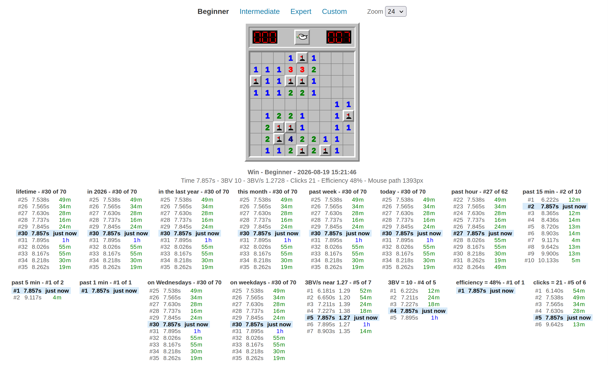

# Minesweeper Friendly

**Play instantly, free, in your browser: https://ernop.github.io/minesweeper-friendly/**

The classic game you know — crisp bevels, chunky numbers, red LCD counters —
with a dove where the smiley used to be, and a scoreboard unlike anything
minesweeper has ever had.

## Every win you ever get is remembered

Finish a board and the game instantly places that win in *your* history from
two dozen angles at once:

- Where does it rank among everything you've ever played? This month? Today?
  In the last fifteen minutes? The last *minute*?
- How do you do on Wednesdays? On weekends? On holidays?
- Among games with a similar solve rate? The exact same number of clicks?
- Which click counts and efficiencies produce your fastest average times?

Each list draws you bolded in context — the scores just above you, the scores
just below — so every single game gives you something to chase. You're never
just "not a record." You're two seconds off your Wednesday best, or one spot
from your top-20 of the month, or on a fresh streak in the last five minutes.

## The details feel right

- First click is always safe
- Chording, press preview, and flag counting exactly as the classics did it
- Times to the millisecond, 3BV, 3BV/s, clicks, efficiency — even how far
  your mouse traveled
- Nothing to install, no account, no server: your scores live in your browser
  and load instantly

Beginner, Intermediate, Expert, and fully custom boards. Zoom to taste.

**Play now: https://ernop.github.io/minesweeper-friendly/**
